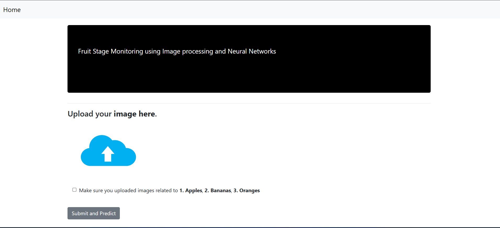
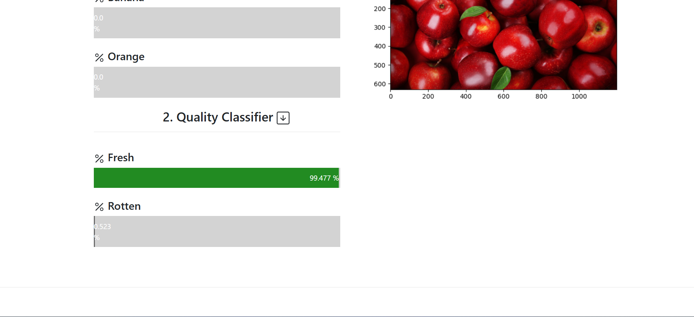

<h1 align="center">🍎 Fruit Stage Monitoring Using Image Processing and CNN 🍌</h1>

<p align="center">
  <b>A Machine Learning project that detects whether a fruit is Fresh or Rotten using CNN and Image Processing.</b>
</p>

## 🚀 Overview
This project uses **Convolutional Neural Networks (CNN)** to classify fruit images into different stages (Fresh or Rotten). 
It is built using **Python, OpenCV, TensorFlow, and Flask**. The web interface allows users to upload images and get real-time classification results.

## 🛠 Tech Stack
- **Python** (NumPy, Pandas, OpenCV, TensorFlow/Keras)
- **CNN (Convolutional Neural Networks)**
- **Flask** (Backend Deployment)
- **HTML, CSS, JavaScript, Bootstrap** (Frontend)

## 🌟 Features
✅ **Fruit Classification** – Detects if a fruit is fresh or rotten.  
✅ **Image Processing** – Enhances input images for better accuracy.  
✅ **Machine Learning Model** – Uses CNN for classification.  
✅ **Flask Web App** – Simple UI for image upload and classification.  

## 📂 Project Structure

## 🎯 How It Works
Upload an image of a fruit.
The model preprocesses the image and applies CNN classification.
The result is displayed, indicating whether the fruit is Fresh or Rotten.
## 📌 Future Enhancements
Improve model accuracy with a larger dataset.
Add more fruit categories.
Develop a mobile-friendly version.
## 💡 Contributing
Pull requests are welcome! Feel free to improve the project.

📝 License
This project is open-source and available under the MIT License.

<p align="center">🍎 Made with ❤️ for AI and Image Processing! 🍌</p> ```

<h1>Home page</h1>

<h1>Prediction page</h1>

<h1>Quality check</h1>
